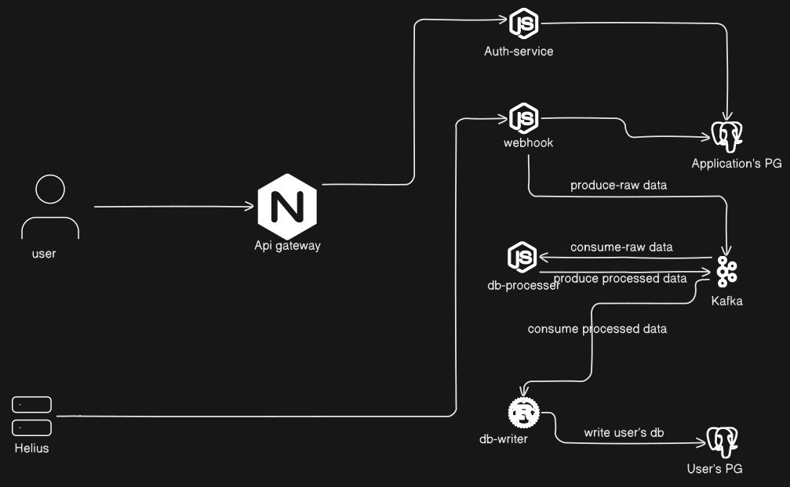

# Sol-Indexer

A scalable, event-driven system for indexing Solana blockchain data, such as NFT sales and token prices, using a microservices architecture.

## Problem

Indexing blockchain data, like NFT sales or token transactions on Solana, presents several challenges: real-time processing of high-volume events, ensuring data consistency across distributed systems, and maintaining scalability as transaction throughput grows. Traditional monolithic approaches struggle with these demands due to tight coupling, limited fault tolerance, and difficulty integrating diverse data sources (e.g., Helius APIs). Additionally, managing logs, configurations, and database migrations across multiple services becomes cumbersome without a standardized, reusable approach.

## Solution

Sol-Indexer addresses these challenges with a microservices-based architecture leveraging Kafka for event streaming, PostgreSQL for persistent storage, and Bun/TypeScript for fast TypeScript execution, alongside Rust for performance-critical components. The system decouples data ingestion (`webhook-service`), processing (`data-processor`), and storage (`db-writer`), enabling independent scaling and fault isolation. A shared `@myrepo/logger` package provides consistent logging across services, while Corepack ensures reproducible dependency management. The web app, built with Next.js and ShadCN, offers a UI for visualizing indexed data, making the system both robust and user-friendly.

## Architecture

The architecture follows an event-driven pattern where blockchain events flow through distinct microservices. The `webhook-service` ingests raw events from Solana (e.g., via Helius webhooks) and publishes them to a Kafka topic (`webhook-events`). The `data-processor` consumes these events, parses them into structured data (e.g., NFT sales), and publishes processed events to another Kafka topic (`processed-events`). The `db-writer`, written in Rust for performance, consumes these processed events and persists them to PostgreSQL. The `auth-service` secures API endpoints, while the web app provides a frontend interface. A shared logger package ensures uniform logging across all services, enhancing observability.

### Architecture Diagram



## Setup Instructions

### Prerequisites

- **Node.js**: v18+
- **Bun**: v1.2.5+ (for TypeScript microservices and web app)
- **Rust**: v1.75+ (for `db-writer`)
- **PostgreSQL**: v15+ (local or remote)
- **Kafka**: v3.x (e.g., via a local installation or a managed service like Aiven)

### Installation

#### Clone the Repository:

```bash
git clone https://github.com/kushwahramkumar2003/sol-indexer
cd sol-indexer
```

#### Install Dependencies:

```bash
bun install
```

#### Configure Environment Variables:

Replace `.env.example` with `.env` for each microservice and populate with your values:

```bash
cp apps/auth-service/.env.example apps/auth-service/.env
cp apps/webhook-service/.env.example apps/webhook-service/.env
cp apps/data-processor/.env.example apps/data-processor/.env
cp apps/db-writer/.env.example apps/db-writer/.env
cp apps/web/.env.example apps/web/.env
```

Example `.env` for `data-processor`:

```ini
KAFKA_BROKERS=localhost:9092
KAFKA_CLIENT_ID=data-processor
LOG_LEVEL=info
```

#### Set Up Kafka:

Install Kafka locally or use a managed service (e.g., Aiven). Update `KAFKA_BROKERS` in `.env` files with your Kafka broker address.

### Start Services

#### Build and Run `db-writer` with Cargo:

```bash
cargo build
```

#### Access the Web App:

Open `https://sol-indexer-web.vercel.app/`

```

```
